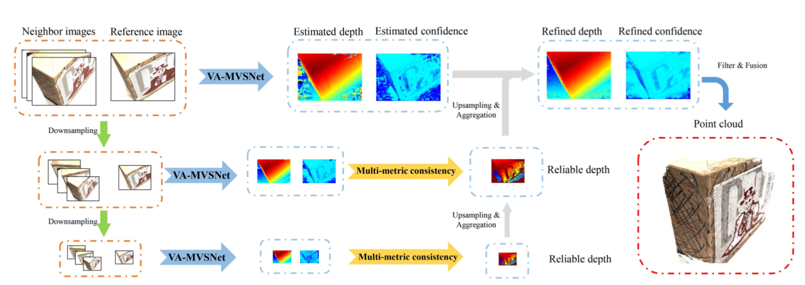

# PVA-MVSNet

## About
Official Code For Pyramid Multi-view Stereo Net with Self-adaptive View Aggregation, [arxiv](https://arxiv.org/pdf/1912.03001.pdf). 

   
# How to Use

## Requirements

* python 3.6
* Pytorch >= 1.0.0
* CUDA >= 9.0

# Install
``./conda_install.sh``

# Training

* Download the preprocessed [DTU training data](https://drive.google.com/file/d/1eDjh-_bxKKnEuz5h-HXS7EDJn59clx6V/view) (also available at [Baiduyun](https://pan.baidu.com/s/1Wb9E6BWCJu4wZfwxm_t4TQ#list/path=%2F), code: s2v2), and upzip it as the ``MVS_TRANING`` folder (orrowed from MVSNet(https://raw.githubusercontent.com/YoYo000/MVSNet)).
* Set ``dtu_data_root`` to your ``MVS_TRAINING`` path in ``env.sh``
Create a log folder and a model folder in wherever you like to save the training outputs. Set the ``log_dir`` and ``save_dir`` in ``train.sh`` correspondingly.
* Train VA-MVSNet (GTX1080Ti):
``./train.sh``

# Testing

* Download the test data for [scan9](https://drive.google.com/file/d/17ZoojQSubtzQhLCWXjxDLznF2vbKz81E/view?usp=sharing) and unzip it as the ``TEST_DATA_FOLDER`` folder, which should contain one ``cams`` folder, one ``images`` folder and one ``pair.txt`` file.
* Download the pre-trained VA-MVSNet [models](https://drive.google.com/file/d/1sp8A9DGEj7wrKCophIEWE-M6H8qVwTmt/view) and upzip the file as ``MODEL_FOLDER``
* In ``eval_pyramid.sh``, set ``MODEL_FOLDER`` to ``ckpt`` and ``model_ckpt_index`` to ``checkpoint_list``.
* Run ``./eval_pyramid.sh``.

# MMP and Filter&Fusion
* We utilize ``depthfusion_pytorch.py`` script for Fusion (from [MVSNet-pytorch](https://github.com/xy-guo/MVSNet_pytorch)).
* Set ``use_mmp`` as ``True`` to use Multi-metric Pyramid Depth Aggregation in ``tools/postprocess.sh``.
* Run ``./tools/postprocess.sh`` to generate final point cloud.


# Reproduce Benchmark results

## Results on DTU
|                       | Acc.   | Comp.  | Overall. |
|-----------------------|--------|--------|----------|
| MVSNet(D=256)         | 0.396  | 0.527  | 0.462    |
| PVAMVSNet(D=192)      | 0.372  | 0.350  | 0.361    |

PVA-MVSNet point cloud results with full post-processing are also provided: [DTU evaluation point clouds](https://Will_release_as_soon_as_possible).

## Results on Tanks and Temples
| Mean   | Family | Francis | Horse  | Lighthouse | M60    | Panther | Playground | Train |
|--------|--------|---------|--------|------------|--------|---------|------------|-------|
| 49.08  |	62.02 |	 40.71	|  37.70 |    9.10    | 54.03  |  51.01	 |   54.92    |	43.14 |

Please ref to [leaderboard](https://www.tanksandtemples.org/details/691/).

# Citation

If you find this project useful for your research, please cite:
```
@article{yao2018mvsnet,
  title={MVSNet: Depth Inference for Unstructured Multi-view Stereo},
  author={Hongwei Yi, Zizhuang Wei, Mingyu Ding, Runze Zhang, Yisong Chen, Guoping Wang, Yu-Wing Tai},
  journal={{arxiv preprint arXiv:1912.03001},
  year={2019}
}
```

# Acknowledgement
Thanks Xiaoyang Guo for his contribution to re-implementation of [MVSNet-pytorch](https://github.com/xy-guo/MVSNet_pytorch). Thanks Yao Yao for his previous works [MVSNet/R-MVSNet](https://github.com/YoYo000/MVSNet). 


